# Camper-Van Bohsung

## Inhaltsverzeichnis

- [Quick Start](#quick-start)
- [Bordnetz (12V)](#bordnetz-12v)
- [Bordnetz (230V)](#bordnetz-230v)
- [Winterschlaf](#winterschlaf)
- [Wartung](#wartung)
- [Notfall](#notfall)
- [Support & Kontakt](#support--kontakt)
- [Legende (Bilder)](#legende-bilder)

## Quick Start

> ***WICHTIG:***  
*Bevor es losgehen kann, solltest du sicher gehen, dass die komplette Bordelektrik aktiv und bereit für die nächste Reise ist.*

Kontrolliere folgendes:

1. Kommt der Camper gerade aus seinem **Winterschlaf**?  
-> Dann befolge den Abschnitt [Winterschlaf -> Aufwecken](#aufwecken) genauestens.

2. Ist im Display des [Batterie-Computers](#batterie-computer) oben mittig **"OFF"** zu lesen?  
-> Dann befolge den Abschnitt [Bordnetz (12V) -> Manuell einschalten](#manuell-einschalten).

3. Ist die [Versorgungsbatterie](#versorgungsbatterie) stark entladen *(**<50%** [Ladezustand](#ladezustand-))*?  
-> Dann befolge den Abschnitt [Bordnetz (12V) -> Versorgungsbatterie laden](#versorgungsbatterie-laden).

Trifft hier nichts weiter zu, ist der Camper vonseiten der Bordelektrik bereit für seine nächste Reise.

## Bordnetz 12V

Folgendes wird über die 12V-Versorgung gespeist:

- **Licht** *(LED-Beleuchtung unter der Decke links & rechts, über der Küchenzeile, im Einstiegsbereich, sowie beide Leselampen über dem Bett)*
- **[12V-Dosen](#5v-usb--12v-dosen)** *(2x - 10A max. insgesamt)*
- **[5V USB](#5v-usb--12v-dosen)** *(2x 1A & 2x 2.1A)*

### Nutzung

Um jegliche 12V-Verbraucher nutzen zu können, muss nichts weiter unternommen werden.

> ***WICHTIG:***  
*Achte stetig darauf, dass der [Ladezustand](#ladezustand-) der [Versorgungsbatterie](#versorgungsbatterie) nicht unter **50%** fällt.  
Ist dies dennoch der Fall, siehe zu, dass du möglichst bald wieder laden kannst. Infos dazu findest du im Abschnitt [Bordnetz (12V) -> Versorgungsbatterie laden](#versorgungsbatterie-laden).  
Falls er jedoch unter die Marke von **30%** (oder **10,5V** [Batterie-Spannung](#spannung-versorgungsbatterie-v)) fällt, so greift der [Tiefenentladeschutz](#tiefenentladeschutz) und schaltet die 12V-Bordelektrik automatisch ab, um einen **Schaden** zu verhindern.*

### Überwachung

Mit dem [Batterie-Computer](#batterie-computer) hast du zu jeder Zeit den vollen Überblick über die 12V-Bordelektrik.  
Mit den beiden **Pfeiltasten** *(links & mittig)* kannst du zwischen den einzelnen **Anzeigen wechseln**. Die einzelnen Anzeigen sind folgend genauer beschrieben:

#### Status (ON/OFF)

Hier kannst du sehen, ob die **12V-Bordelektrik** aktuell **eingeschaltet (ON)** oder **abgeschaltet (OFF)** ist.

#### Balken-Anzeige

Hier kannst du immer den aktuellen **Ladezustand** der [Versorgungsbatterie](#versorgungsbatterie) grob als Balken-Anzeige in **10% Schritten** sehen.

#### Ladezustand (%)

Hier kannst du den aktuellen **Ladezustand** der [Versorgungsbatterie](#versorgungsbatterie) in **Prozent (%)** einsehen.

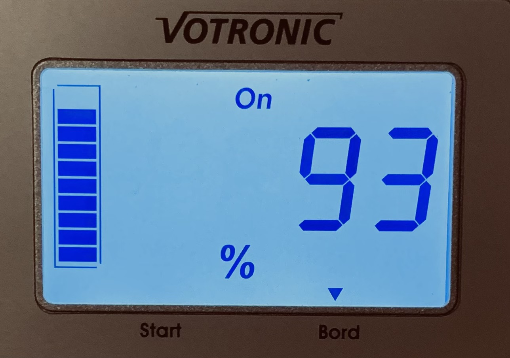

#### Ladezustand (Ah)

Hier kannst du den aktuellen **Ladezustand** der [Versorgungsbatterie](#versorgungsbatterie) in **Amperestunden (Ah)** einsehen.

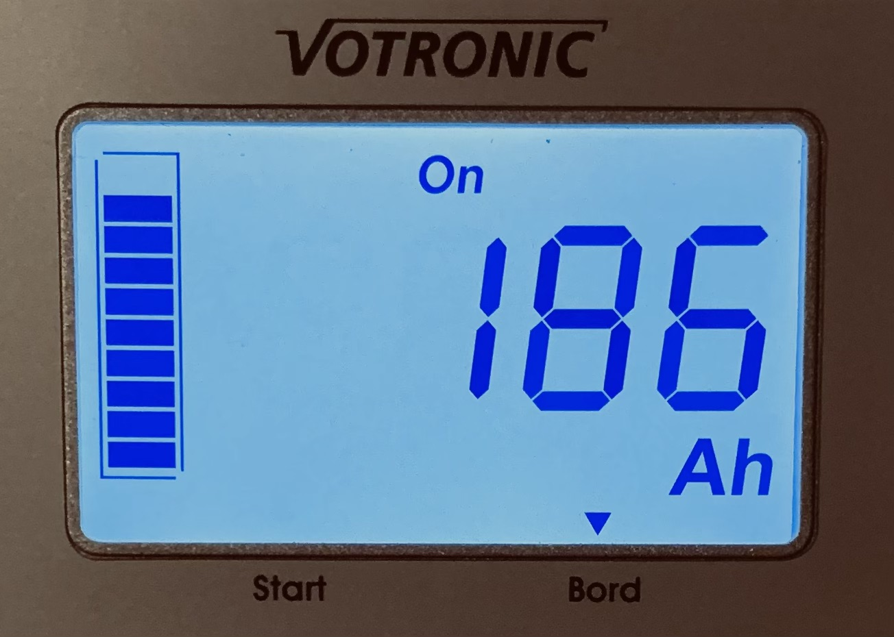

#### Strom (A)

Hier kannst du den aktuellen **Stromfluss** von und zur [Versorgungsbatterie](#versorgungsbatterie) in **Ampere (A)** einsehen.

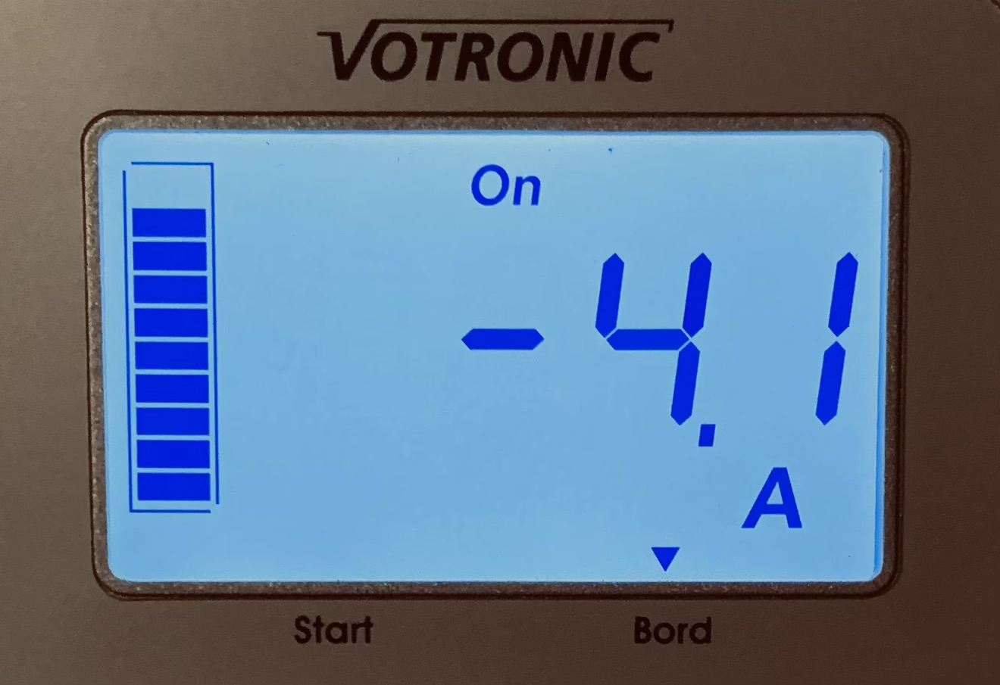

> ***INFO:***  
*Ist der Wert negativ (-), so wird der [Versorgungsbatterie](#versorgungsbatterie) aktuell Strom entnommen.  
Steht kein Vorzeichen vor dem Wert, so wird diese aktuell geladen (Erkennbar durch den Schriftzug "Charge" oben rechts im Display).*

#### Spannung Versorgungsbatterie (V)

Hier kannst du die aktuelle **Spannung** der **[Versorgungsbatterie (Board)](#versorgungsbatterie)** in **Volt (V)** einsehen.

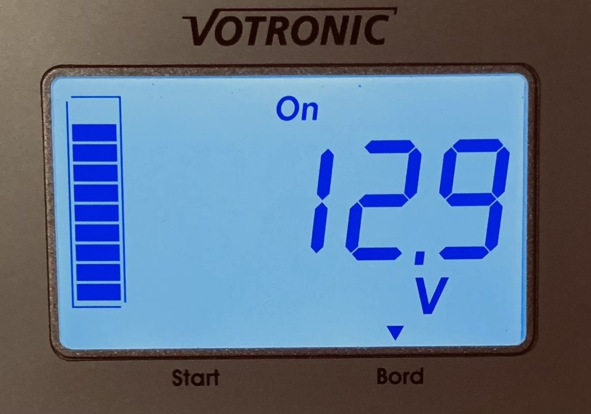

#### Spannung Starterbatterie (V)

Hier kannst du die aktuelle **Spannung** der **Fahrzeugbatterie (Start)** in **Volt (V)** einsehen.

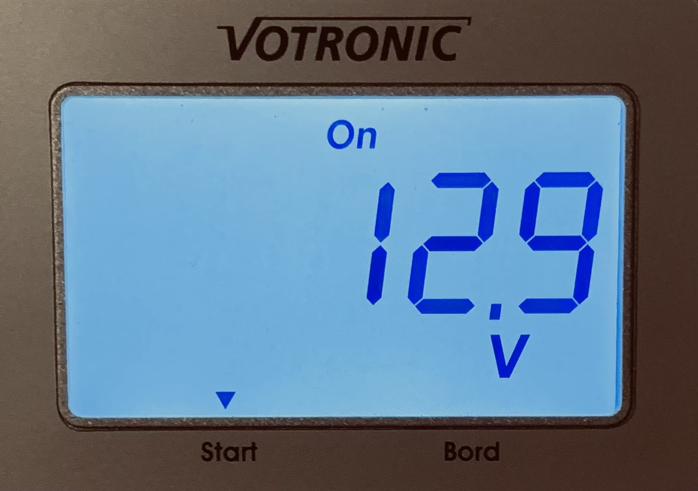

#### Verbleibende Zeit (h)

Hier kannst du die **verbleibende Zeit** abhängig vom aktuellen [Stromverbrauch](#strom-a) im Camper und dem aktuellen [Ladezustand](#ladezustand-) der [Versorgungsbatterie](#versorgungsbatterie) in **Stunden (h)** einsehen.

### Versorgungsbatterie laden

Um die [Versorgungsbatterie](#versorgungsbatterie) zu laden, gibt es drei verschiedene Möglichkeiten:

1. **Solar**:  
Um die [Versorgungsbatterie](#versorgungsbatterie) durch Sonnenenergie laden zu können, muss nichts weiter unternommen werden. Sobald der **Camper in der Sonne** steht, lädt diese automatisch auf *(Erkennbar an dem Schriftzug "Charge" oben rechts im Display)*.  
Steht man jedoch in einem eher schattigen Gebiet und der [Ladezustand](#ladezustand-) sinkt stetig, so muss man sich um eine alternative Lademöglichkeit kümmern.

2. **Ladebooster**:  
Um die [Versorgungsbatterie](#versorgungsbatterie) während der Fahrt zu laden, muss ebenfalls nichts weiter unternommen werden. Sobald der **Motor läuft** und die Lichtmaschine genügend Strom erzeugt, wird diese automatisch mit aufgeladen *(Erkennbar an dem Schriftzug "Charge" oben rechts im Display)*.

3. **Landstrom**:  
Um die [Versorgungsbatterie](#versorgungsbatterie) auch dann laden zu können, wenn der Camper mal nicht genug Solarstrom zur Verfügung hat und auch nicht alle paar Tage für eine Weile gefahren wird, so kann man das Fahrzeug einfach über die [CEE-Dose](#cee-dose) direkt mit dem **Landstrom verbinden** und somit den Ladevorgang starten.  
Zusätzlich dazu sollte nun ebenfalls Strom an der [230V-Steckdose](#230v-steckdose) im Camper-Innenraum anliegen. Ist dies beides nicht der Fall, kontrolliere den [FI-Leitungsschutzschalter](#fi-leitungsschutzschalter-landstrom) und stelle sicher, dass dieser **eingeschaltet (ON/Rot)** ist.

### Tiefenentladeschutz

Im Idealfall sollte die [Versorgungsbatterie](#versorgungsbatterie) nicht unter **50%** entladen werden.  
Sollte es jedoch dazu kommen, dass der [Ladezustand](#ladezustand-) unter **30%** fällt, schaltet sich das 12V-Bordnetz automatisch ab, da sonst die **Batterie-Lebensdauer** zu stark darunter leiden würde.

Erkennbar ist die abgeschaltete 12V-Bordelektrik daran, dass im Display des [Batterie-Computers](#batterie-computer) oben mittig **"OFF"** zu lesen ist.

> ***INFO:***  
*Falls du trotz automatisch abgeschalteter 12V-Bordelektrik dringend **weiterhin Strom** benötigst und dafür auch eine Lebensdauer-geschädigte [Versorgungsbatterie](#versorgungsbatterie) in Kauf nimmst, so kannst du an der [Switch Unit 100](#switch-unit-100) unten mittig das **Relais manuell** wieder **schließen (ON)**, um so den Stromfluss wiederherzustellen.*

### Sicherung

Falls einmal eine Sicherung durchbrennt, so lässt sich diese ganz einfach in einem der beiden [12V-Sicherungskästen](#12v-sicherungskästen) **unter** der *(in Fahrtrichtung)* **linken Sitzgelegenheits-Abdeckung** austauschen.

> ***INFO:***  
*Sollte weiterhin Strom am 12V-Bordnetz anliegen, so ist eine **defekte Sicherung** durch eine rot **leuchtende LED** erkennbar.*

### Manuell abschalten

Möchtest du die [Versorgungsbatterie](#versorgungsbatterie) von der 12V-Bordelektrik trennen, so kannst du dies über den [Batterie-Computer](#batterie-computer) vornehmen.

Halte hierfür die **DOWN-Taste** *(links)* am [Batterie-Computer](#batterie-computer) für ca. **3 Sekunden** gedrückt. Nun sollte im Display oben mittig **"OFF"** zu lesen sein.

### Manuell einschalten

Möchtest du die [Versorgungsbatterie](#versorgungsbatterie) an die 12V-Bordelektrik anschließen, so kannst du dies über den [Batterie-Computer](#batterie-computer) vornehmen.

Halte hierfür die **UP-Taste** *(mittig)* am [Batterie-Computer](#batterie-computer) für ca. **3 Sekunden** gedrückt. Nun sollte im Display oben mittig **"ON"** zu lesen sein.

## Bordnetz 230V

Folgendes wird über die 230V-Versorgung gespeist:

- **[230V-Steckdose](#230v-steckdose)** *(1x als Kombi inkl. 2x 5V USB-Dosen)*

### Nutzung

> ***ACHTUNG LEBENSGEFAHR:***  
*Schließe **NIEMALS mehr als EIN Gerät** an deine im Camper verbaute [230V-Steckdose](#230v-steckdose) an! Auch nicht per Mehrfachsteckdose!*

Um die [230V-Steckdose](#230v-steckdose) nutzen zu können, gibt es zwei verschiedene Möglichkeiten:

1. **Landstrom**:  
Hierfür musst du lediglich das Fahrzeug über die [CEE-Dose](#cee-dose) mit dem **Landstrom verbinden**. Nun sollte die [230V-Steckdose](#230v-steckdose) bereits vollumfänglich nutzbar sein. Ist dies nicht der Fall, kontrolliere den [FI-Leitungsschutzschalter](#fi-leitungsschutzschalter-landstrom) und stelle sicher, dass dieser **eingeschaltet (ON/Rot)** ist.

2. **Solar/Batterie**:  
Schalte hierfür am [230V-Kontrollpanel](#230v-kontrollpanel) den [Wechselrichter](#wechselrichter) ein. Auch hierfür hast du zwei verschiedene Möglichkeiten:

    1. **UPS (I)** - Landstrom-Vorrangschaltung ***(Empfohlen)***:  
    Bei dieser Option handelt es sich um eine **Unterbrechungsfreie Stromversorgung**. Solange der Landstrom angeschlossen ist, wird dieser vorrangig genutzt und nur falls dieser ausfällt *(oder gar nicht erst angeschlossen ist)*, wird automatisch ohne Umschaltzeit auf Solar/Batterie-Strom umgeschaltet.

        Das bedeutet, dass die [Versorgungsbatterie](#versorgungsbatterie) lediglich dann genutzt wird, wenn KEIN Landstrom zur Verfügung steht.

    2. **ECO (II)** - Solar/Batterie-Vorrangschaltung:  
    Bei dieser Option läuft der **[Wechselrichter](#wechselrichter)** standartmäßig über Solar/Batterie-Strom und erst wenn dieser nicht mehr ausreichend verfügbar ist *([Versorgungsbatterie](#versorgungsbatterie) leer)*, wird automatisch ohne Umschaltzeit auf Landstrom *(sofern vorhanden)* umgeschaltet.

        Das bedeutet, dass der Landstrom lediglich dann genutzt wird, wenn KEIN Solar/Batterie-Strom zur Verfügung steht.

    > ***WICHTIG:***  
    *Benötigst du nicht länger Strom über die [230V-Sterckdose](#230v-steckdose), so kannst du den [Wechselrichter](#wechselrichter) am [230V-Kontrollpanel](#230v-kontrollpanel) wieder ausschalten (OFF)*.

### FI & Sicherung

Sollte doch einmal der [FI-Leitungsschutzschalter](#fi-leitungsschutzschalter-landstrom) fliegen, so kannst du diesen im **untersten Fach** der Küchenzeile, hinten im **Sicherungskasten** wieder **einschalten (ON/Rot)**. 

> ***INFO:***  
*Falls dieser nicht geflogen ist und/oder du weiterhin **keinen Strom** hast, kann es gut sein, dass die Sicherung vom **Stromverteiler des Campingplatz** o.Ä. selbst geflogen ist.*

## Winterschlaf

Um den Camper samt seiner kompletten Bordelektrik *(inkl. [Versorgungsbatterie](#versorgungsbatterie))* gut durch den Winter zu bringen, empfiehlt es sich, diesen in einem möglichst **kältegeschützten Bereich** unterzustellen.

### Einschläfern

Bevor du die komplette Bordelektrik für den Winterschlaf zur Ruhe bringst, sollte die [Versorgungsbatterie](#versorgungsbatterie) unbedingt vorher möglichst **voll geladen** sein. Infos dazu findest du im Abschnitt [Bordnetz (12V) -> Versorgungsbatterie laden](#versorgungsbatterie-laden).

Um die Elektrik nun bestens auf die lange Pause vorzubereiten, befolge folgende Schritte:

1. [Solar-Trennschalter](#solar-trennschalter) **ausschalten (OFF)**.

2. [Haupt-Trennschalter](#haupt-trennschalter) **ausschalten (OFF)**.

### Überwintern

Die [Versorgungsbatterie](#versorgungsbatterie) muss nun einmal **alle 4-6 Wochen geladen werden**. Hierfür gibt es zwei verschiedene Möglichkeiten:

1. **Batterie-Ladegerät**:  
Die [Versorgungsbatterie](#versorgungsbatterie) direkt an ihren beiden Polen an ein geeignetes Batterie-Ladegerät (für **AGM Batterien**) anschließen und abwarten bis diese **vollständig geladen** wurde. Dies kann je nach [Ladezustand](#ladezustand-) und Ladegerät einige Stunden bis hin zu 2 Tagen dauern.

2. **Landstrom**:  
Den [Haupt-Trennschalter](#haupt-trennschalter) **einschalten (ON)** und das Fahrzeug über die [CEE-Dose](#cee-dose) direkt mit dem **Landstrom verbinden** und mindestens **12-24h** angesteckt lassen.  
Nach erfolgtem Ladevorgang den **Landstrom vom Fahrzeug trennen** und den [Haupt-Trennschalter](#haupt-trennschalter) wieder **ausschalten (OFF)**.

    > ***INFO:***  
    *Wichtig hierbei ist, dass der [FI-Leitungsschutzschalter](#fi-leitungsschutzschalter-landstrom) **eingeschaltet (ON/Rot) ist**.*

### Aufwecken

1. [Haupt-Trennschalter](#haupt-trennschalter) **einschalten (ON)**.

2. [Solar-Trennschalter](#solar-trennschalter) **einschalten (ON)**.

3. Die [Versorgungsbatterie](#versorgungsbatterie) einmal auf **100%** voll laden.

    > ***WICHTIG:***  
    *Hierbei darf sich **NICHT** auf die [Ladezustands-Anzeige](#ladezustand-) vom [Batterie-Computer](#batterie-computer) verlassen werden, da dieser (nachdem er vom Strom getrennt war) immer wieder bei 100% startet!*

    Um die [Versorgungsbatterie](#versorgungsbatterie) einmal ganz aufzuladen und den [Batterie-Computer](#batterie-computer) neu zu kalibrieren, gibt es drei verschiedene Möglichkeiten:

    1. **Landstrom** ***(Sicherste Methode)***:  
    Das Fahrzeug über die [CEE-Dose](#cee-dose) für min. **24h an den Landstrom anschließen**. Somit kann gewährleistet werden, dass die [Versorgungsbatterie](#versorgungsbatterie) nun wirklich 100% ihrer Ladekapazität erreicht hat.

    2. **Ladebooster**:  
    Das Fahrzeug für **einige Stunden fahren**, sodass die [Versorgungsbatterie](#versorgungsbatterie) durch den [Ladebooster](#ladebooster) von der Lichtmaschine mit aufgeladen wird.  
    Um sicherzugehen, dass diese auch wirklich 100% ihrer Ladekapazität erreicht hat, sollte bei laufendem Motor am [Batterie-Computer](#batterie-computer) der Ladestrom überprüft werden. Wenn dieser relativ niedrig ist *(Ca. < 2A)*, so kann davon ausgegangen werden, dass diese nun voll aufgeladen ist.

    3. **Solar**:  
    Das Fahrzeug für **einige Tage in der Sonne stehen lassen**, sodass die [Versorgungsbatterie](#versorgungsbatterie) durch den Solarstrom aufgeladen wird.  
    Um sicherzugehen, dass diese auch wirklich 100% ihrer Ladekapazität erreicht hat, sollte bei starker Sonneneinstrahlung am [Batterie-Computer](#batterie-computer) der Ladestrom überprüft werden. Wenn dieser relativ niedrig ist *(Ca. < 2A)*, so kann davon ausgegangen werden, dass diese nun voll geladen ist.

## Wartung

> ***WICHTIG:***  
*Falls am Bordnetz Wartungen vorzunehmen sind, wird strengstens empfohlen **ALLE Stromquellen** vom System zu **trennen**, um so an einem komplett stromlosen System arbeiten zu können!*

Gehe folgendermaßen vor:

1. Motor **ausschalten** *(wenn laufend)*.

2. Landstrom **trennen** *(wenn angeschlossen)*.

3. [FI-Leitungsschutzschalter](#fi-leitungsschutzschalter-landstrom) **ausschalten (OFF/Grün)**.

4. [Solar-Trennschalter](#solar-trennschalter) **ausschalten (OFF)**.

5. [Haupt-Trennschalter](#haupt-trennschalter) **ausschalten (OFF)**.

Nach einer erfolgreichen Wartung kannst du die oben beschriebenen Schritte in umgekehrter Reihenfolge wieder rückgängig machen. Prüfe danach unbedingt erneut, ob weiterhin alles wie geplant funktioniert!

## Notfall

**[Haupt-Trennschalter](#haupt-trennschalter) ausschalten (OFF)**

Sollte irgendetwas mal schiefgehen *(**Kabelbrand o.Ä.**)*, so kannst du ganz einfach die [Versorgungsbatterie](#versorgungsbatterie) vom Bordnetz trennen, indem du den [Haupt-Trennschalter](#haupt-trennschalter) **ausschaltest (OFF)**. Dieser befindet sich unter der *(in Fahrtrichtung)* linken Sitzgelegenheits-Abdeckung.

Weitere Schritte für eine sichere Begutachtung des Systems sind im Abschnitt [Wartung](#wartung) aufgelistet.  
Für weitere Hilfe siehe unter [Support & Kontakt](#support--kontakt).

## Support & Kontakt

Hast du weiterhin **Probleme** mit der Bordelektrik?

Kontaktiere mich gerne per **WhatsApp** oder **Signal**.

Meine **Telefonnummer** findest du bei der Bordelektrik unter der *(in Fahrtrichtung)* linken Sitzgelegenheits-Abdeckung.

## Legende (Bilder)

### Batterie-Computer:

Mit dem **Batterie-Computer** kannst du die 12V-Bordelektrik überwachen und steuern. Mehr Infos dazu findes du im Abschnitt [Bordnetz (12V) -> Überwachung](#überwachung).

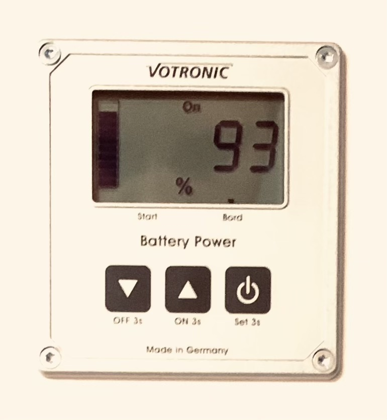

### 230V-Kontrollpanel:

Mit dem **230V-Kontrollpanel** kannst du den [Wechselrichter](#wechselrichter) bedienen, der dafür sorgt, dass du auch unterwegs und ohne Landstrom Zugang zu deinem 230V-Bordnetz hast.

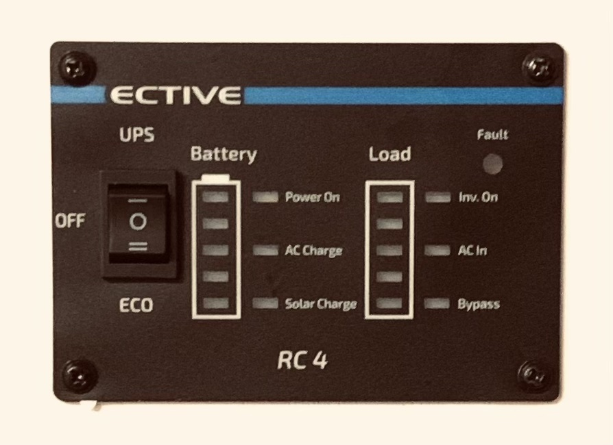

### 230V-Steckdose:

Mit der **230V-Steckdose** hast du auch in deinem Camper Zugriff auf entweder den angeschlossenen Landstrom oder aber auch den vom [Wechselrichter](#wechselrichter) generierten, sinusförmigen 230V Wechselstrom für unterwegs.

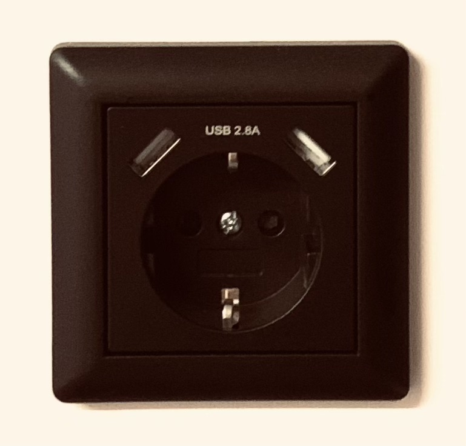

### 5V USB & 12V-Dosen:

Mit den vier **5V USB-Steckplätzen** hast du immer und überall die Möglichkeit kleine elektronische Geräte wie Handys, Kameras und Co. zu laden.

Mit den zwei **12V-Dosen** kannst du jegliche Gerät mit Strom versorgen, welche sonst im Zigarettenanzünder angeschlossen werden.
 
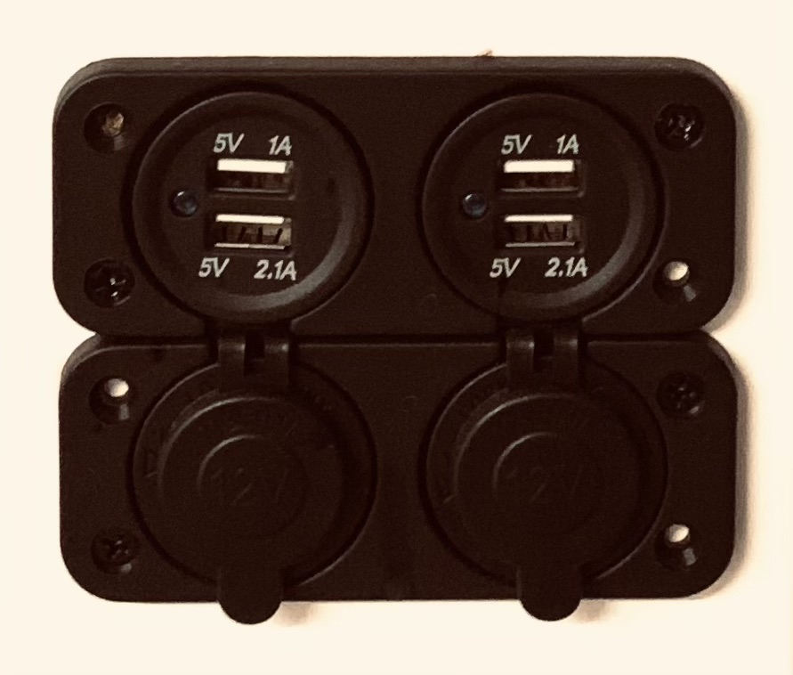

### Haupt-Trennschalter:

Mit dem **Haupt-Trennschalter** kannst du wenn nötig die [Versorgungsbatterie](#versorgungsbatterie) komplett von der restlichen Bordelektrik trennen. Dies ist normalerweise nicht von Nöten, sondern ist lediglich für die [Überwinterung](#überwintern), [Wartungen](#wartung) oder im [Notfall](#notfall) vorgesehen.

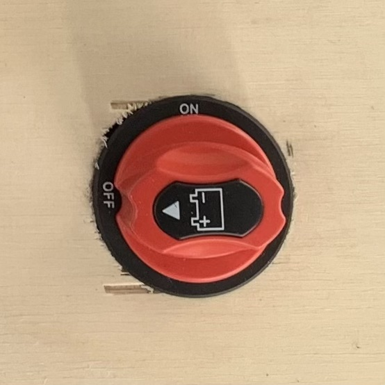

### Solar-Trennschalter:

Mit dem **Solar-Trennschalter** kannst du wenn nötig die Solar-Panels vom Dach von der restlichen Bordelektrik trennen. Dies ist normalerweise nicht von Nöten, sondern ist lediglich für die [Überwinterung](#überwintern), [Wartungen](#wartung) oder im [Notfall](#notfall) vorgesehen.

### 12V Sicherungskästen:

Mit den beiden **12V Sicherungskästen** ist deine 12V-Bordelektrik vor gefährlichen Kabelbränden geschützt. Fließt an einer Stelle mehr Strom als erwartet, brennt die Sicherung durch und kann danach *(nach genauer Fehlerüberprüfung)* wieder ausgetauscht werden. Das ganze funktioniert natürlich nur dann einwandfrei, wenn die Sicherungen korrekt ausgewählt wurden. Hierfür sollte, im Vergleich zum ausgerechneten Stromverbrauch für den einzelnen Verbraucher, immer die nächst-größere Sicherung ausgewählt werden.

### Switch-Unit 100:

Mit der **Switch-Unit 100** wird sichergestellt, dass es nicht zu einer ungewollten [Tiefenentladung](#tiefenentladeschutz) kommt. Sie fungiert als Schalter *(Relais)* und trennt bei Bedarf durch ein externes Signal vom [Batterie-Computer](#batterie-computer) die [Versorgungsbatterie](#versorgungsbatterie) von der restlichen Bordelektrik.

### Ladebooster:

Mit dem **Ladebooster** hast du die Möglichkeit auch während der Fahrt die [Versorgungsbatterie](#versorgungsbatterie) über die Lichtmaschine mit aufzuladen. Es handelt sich hierbei um einen 50A Ladebooster der Firma Votronic.

### Wechselrichter:

Mit dem **Wechselrichter** hast du die Möglichkeit auch unterwegs und ohne angeschlossenen Landstrom Zugang zu deinem 230V-Bordnetz zu haben. Es handelt sich hierbei um einen 1000W Wechselrichter mit integriertem MPPT-Solarladeregler und Landstrom-Ladegerät der Firma Ective.

### Versorgungsbatterie:

Mit der **Versorgungsbatterie** wird die komplette Bordelektrik mit Strom versorgt. Es handelt sich hierbei um eine 12V 230Ah AGM Batterie der Firma Ective.

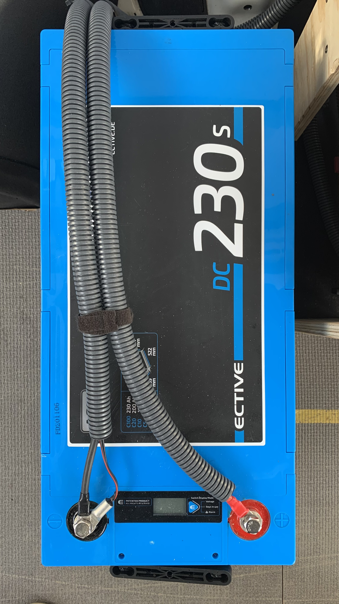

### CEE-Dose:

Mit der **CEE-Dose** kann der Landstrom sicher zum Laden der [Versorgungsbatterie](#versorgungsbatterie) und zum Nutzen der [230V-Steckdose](#230v-steckdose) im Innenraum des Campers in das Fahrzeug eingespeist werden.

### FI-Leitungsschutzschalter (Landstrom):

Mit dem **FI-Leitungsschutzschalter** wird die 230V-Bordelektrik abgesichert. Du findest diesen im **untersten Fach** der Küchenzeile, hinten im **Sicherungskasten**.

